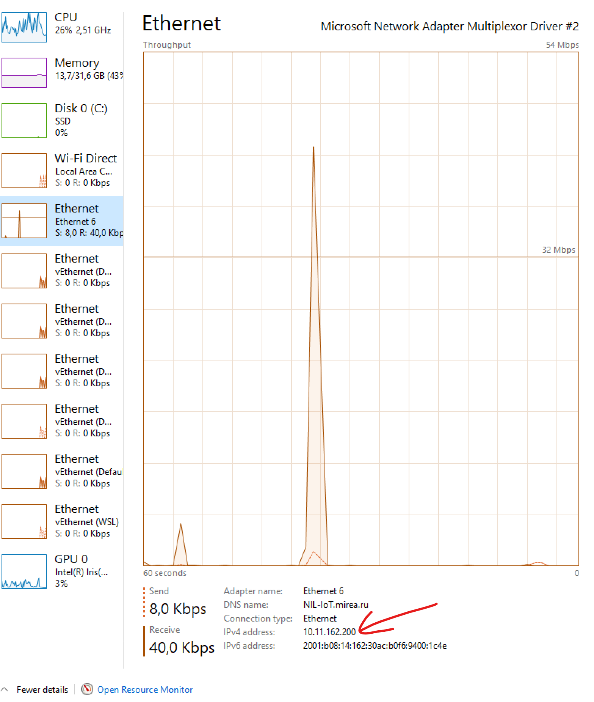

# Работа с JSON-server

JSON сервер - удобный инструмент для организации заглушечного серверного API, при помощи которого можно без написания сервера создавать мобильные приложения, которые будут на самом деле хранить и изменять данные в едином общем пространстве, доступном по сети.

## Установка

Между каждым последующим шагом желательно перезапускать терминал, для того чтобы он "увидел" установленные инструменты. Особенно актуально для Windows.

1. Установить Node.JS
    Это инструмент, позволяющий запускать JavaScript код на компьютере, скачать можно с [официального сайта](https://nodejs.org/), советую брать версию LTS. Установка тривиальная, никаких важных опций по ходу процесса быть не должно.
2. Установить `json-server`, командой
    ```bash
    npm i -g json-server
    ```
    npm - Node Package Manager, инструмент для управления зависимостями для Node.JS, поверхностно можно сравнить с gradle в мире Java.

    * i: install, установить инструмент/библиотеку
    * -g: global, установить инструмент глобально, чтобы он стал доступен из терминала в любом месте системы
3. Проверить работоспособность `json-server` выполнив в терминале команду
    ```bash
    json-server
    ```
    > На Windows в этот момент может произойти ошибка, так как под капотом эта команда запускает PowerShell скрипт, выполнение которых заблокировано настройкой безопасности. Для исправления этой ситуации надо открыть powershell от имени администратора, самый простой способ - `Win + X`, и там найти соответствующий пункт. И в открывшемся терминале выполнить команду

      >```pwsh
      >Set-ExecutionPolicy -ExecutionPolicy RemoteSigned
      >```

## Использование
1. Подготовить файл с данными.

    Для работы с этим инструментом необходимо создать JSON файл, например `db.json`, с примерно следующим контентом
    ```js
    {
      "heroes": [ // Коллекция объектов - героев
        { // один герой
          "id": 1, // Идентификатор героя, используется json-server-ом для поиска элементов
          "name": "Karl", // Имя героя, является произвольным полем, как и все остальные
          "isAlive": true // Пример использования bool типа
        },
        {
          "id": 2, // При ручном создании сущностей необходимо соблюдать уникальность поля id
          "name": "Michail" // Не все поля необходимы, JSON никак не регламентирует, а json-server просит только id
        }
      ]
    }
    ```
    В данном примере расписаны комментарии для ясности, в JSON комментариев как таковых нет, данный пример можете скачать забрать [отсюда](db-example.json)

    В данном примере есть только одна коллекция `heroes`, если вам необходимо - вы можете создавать любое количество коллекций объектов, просто создавая дополнительные поля, и заполняя их списками по аналогии.
3. Запустить `json-server`, передав ему путь к созданному файлу.

    **ВАЖНО** обратить внимание на путь, который вы "скармливаете" команде, если он относительный - проверяйте текущий путь терминала.
    ```bash
    json-server -w ./dn.json
    ```
    -w: watch, наблюдать за файлом, так все изменения, которые вы сделаете с файлом даже после запуска программы будут доступны через API, удобно, когда вы пишете файл, и проверяете, какие данные получаются вашим приложением
4. Использование запущенного сервера с компьютера.

    Сейчас вы можете перейти по адресу http://localhost:3000/ и увидеть приветственную страницу сервера, который сообщит, какя информация вам доступна. По адресу http://localhost:3000/heroes/ вы получите коллекцию героев в формате json, по пути http://localhost:3000/heroes/2 вы получите информацию о конкретном герое, если герой с `id==2` присутствует в коллекции

    Фактически браузер отправляет `GET` запросы к `json-server`, но последний так же может принимать и `POST`, `PUT`, `DELETE` запросы для манипуляциями данными, и они будут обновляться в файле автоматически. Как это работает - можете прочитать в [документации](https://github.com/typicode/json-server)

5. Использование запущенного сервера с эмулятора.

    `json-server` принимает запросы  с локального компьютера - в предыдущем пункте мы обращались к нему по адресу `localhost`, который по всеобщей договоренности читается как `127.0.0.1`, который в свою очередь является loopback адресом, который фактически направляет запрос на ту же машину, из которой был послан запрос. Если попытаться использовать адрес `http://localhost:3000/heroes/` в коде android приложения - ответ получен не будет, ибо запрос шлется не в ОС, на которой запущен эмулятор, а в саму ОС Android, которая запущена в эмуляторе. Вместо localhost для локального тестирования необходимо использовать адрес `10.0.2.2`, он самим эмулятором превращается в "виртуальный" localhost, и на самом деле запрос отправляется в вашу пользовательскую ОС. Разумеется, перейдя в браузере по этому пути вы ничего не увидите, ибо в вашей системе такого адреса, скорее всего, нет. Он доступен именно из эмулятора.

5. Использование запущенного сервера с физического устройства.

    Ни один из двух выше описанных способов не работает, если вы используете физическое устройство для тестирования приложения. `localhost` вам не подходит, так как телефон будет стучаться "сам в себя", а адреса `10.0.2.2` в нем нет, так как это специальная конфигурация эмулятора. Для организации работы с физически другим устройством необходимо явно указывать адрес компьютера в локальной сети, и правильно запустить `json-server`.

    1. Запустить json-server в правильном режиме. По умолчанию он слушает только запросы, инициированные на той же машине, где запущен сам сервис, и будет игнорировать весь трафик, приходящий на самом деле по сети. Сделано это из соображений безопасности. Вам же необходимо дать доступ к этому серверу в локальной сети. Для этого необходимо использовать дополнительный аргумент `--host`
    ```bash
    json-server -w --host 0.0.0.0 db.json
    ```
    В данном примере мы используем адрес `0.0.0.0`, что заставляет `json-server` принимать весь трафик, который придет в этот компьютер. Важно, что это не конечный IP, а тот, на котором слушает, и читается он как "любой".
    2. Найти IP компьютера в той сети, к которой подключен и ваш телефон. На Windows это можно удобно сделать в диспетчере задач
    
    Находите сеть, к которой подключен и ПК и телефон, и используете в Java коде тот IP адрес, который имеется у ПК, показан на скриншоте красной стрелкой.
    
    Такой способ будет работать и из эмулятора, но только если вы при запуске `json-server` прописали аргумент `--host`.

